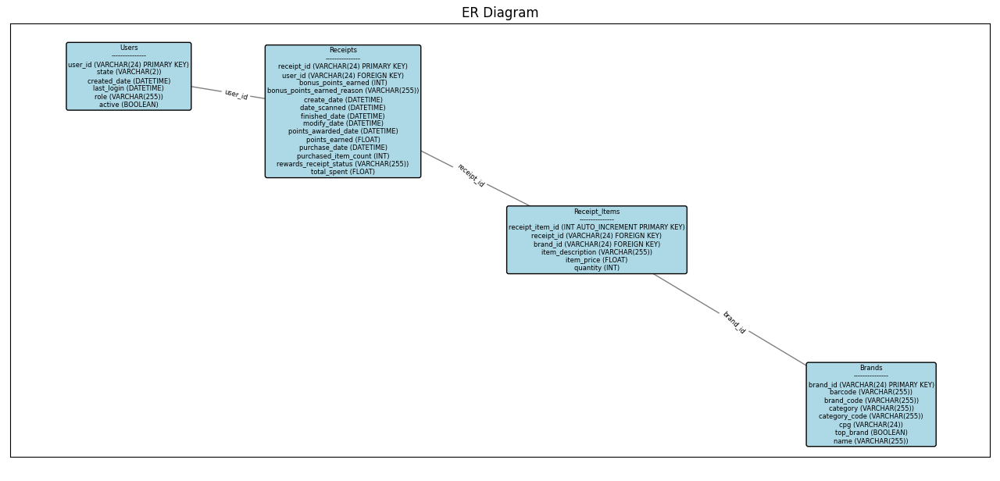

# Fetch_AnalyEng_Exercise

## FIRST: Review Existing Unstructured Data and Diagram a New Structured Relational Data Model

Make sure you have the following libraries:
```
pip install matplotlib
```

```
pip install networkx
```

To generate the <b>ER diagram</b>:
```
python diagram.py
```

You can see the actual diagram:



## SECOND: Write queries that directly answer predetermined questions from a business stakeholder

<details>
        <summary>What are the top 5 brands by receipts scanned for most recent month?</summary>
                       
        WITH RecentMonth AS (
            SELECT 
                    b.name AS brand_name,
                    COUNT(r.receipt_id) AS receipt_count
            FROM 
                    Receipts r
            JOIN 
                    Receipt_Items ri ON r.receipt_id = ri.receipt_id
            JOIN 
                    Brands b ON ri.brand_id = b.brand_id
            WHERE 
                    r.date_scanned >= DATE_FORMAT(NOW() - INTERVAL 1 MONTH, '%Y-%m-01')
                    AND r.date_scanned < DATE_FORMAT(NOW(), '%Y-%m-01')
            GROUP BY 
                    b.name
            ORDER BY 
                    receipt_count DESC
            LIMIT 5
            );
</details>

<details>
        <summary>How does the ranking of the top 5 brands by receipts scanned for the recent month compare to the ranking for the previous month?</summary>

        -- Get the top 5 brands for the most recent month
        WITH RecentMonth AS (
        SELECT 
                b.name AS brand_name,
                COUNT(r.receipt_id) AS receipt_count
        FROM 
                Receipts r
        JOIN 
                Receipt_Items ri ON r.receipt_id = ri.receipt_id
        JOIN 
                Brands b ON ri.brand_id = b.brand_id
        WHERE 
                r.date_scanned >= DATE_FORMAT(NOW() - INTERVAL 1 MONTH, '%Y-%m-01')
                AND r.date_scanned < DATE_FORMAT(NOW(), '%Y-%m-01')
        GROUP BY 
                b.name
        ORDER BY 
                receipt_count DESC
        LIMIT 5
        ),
        -- Get the top 5 brands for the previous month
        PreviousMonth AS (
        SELECT 
                b.name AS brand_name,
                COUNT(r.receipt_id) AS receipt_count
        FROM 
                Receipts r
        JOIN 
                Receipt_Items ri ON r.receipt_id = ri.receipt_id
        JOIN 
                Brands b ON ri.brand_id = b.brand_id
        WHERE 
                r.date_scanned >= DATE_FORMAT(NOW() - INTERVAL 2 MONTH, '%Y-%m-01')
                AND r.date_scanned < DATE_FORMAT(NOW() - INTERVAL 1 MONTH, '%Y-%m-01')
        GROUP BY 
                b.name
        ORDER BY 
                receipt_count DESC
        LIMIT 5
        )
        -- Compare the top brands between the two months
        SELECT 
        rm.brand_name AS recent_month_brand,
        rm.receipt_count AS recent_month_count,
        pm.brand_name AS previous_month_brand,
        pm.receipt_count AS previous_month_count
        FROM 
        RecentMonth rm
        LEFT JOIN 
        PreviousMonth pm ON rm.brand_name = pm.brand_name
        UNION
        SELECT 
        pm.brand_name AS recent_month_brand,
        NULL AS recent_month_count,
        pm.brand_name AS previous_month_brand,
        pm.receipt_count AS previous_month_count
        FROM 
        PreviousMonth pm
        LEFT JOIN 
        RecentMonth rm ON pm.brand_name = rm.brand_name
        WHERE 
        rm.brand_name IS NULL;

</details>

<details>
        <summary>Which brand has the most transactions among users who were created within the past 6 months?</summary>

       -- Get the brand with the most transactions among users created within the past 6 months
        SELECT 
        b.name AS brand_name,
        COUNT(ri.receipt_item_id) AS transaction_count
        FROM 
        Users u
        JOIN 
        Receipts r ON u.user_id = r.user_id
        JOIN 
        Receipt_Items ri ON r.receipt_id = ri.receipt_id
        JOIN 
        Brands b ON ri.brand_id = b.brand_id
        WHERE 
        u.created_date >= NOW() - INTERVAL 6 MONTH
        GROUP BY 
        b.name
        ORDER BY 
        transaction_count DESC
        LIMIT 1;
  

</details>

## THIRD: Evaluate Data Quality Issues in the Data Provided

```
python Data_Quality.py
```

You can checkout the errors found in <b>data_quality_issues.csv</b>.
#### Made SQL Scripts for all json files.
```
python json_to_sql.py
```

The Generated SQL Scripts (MySQL)

* Creating Tables.sql
* brands_insert.sql
* receipts_items_insert.sql
* receipts_insert.sql
* users_insert.sql

When I was trying to do this I was encountering multiple issues but the major issues were Missing Values and Duplicate entries so I tried to go around it as much as possible. 

I also assumed that date format was given as a timestamp in milliseconds so I converted it into YYYY-MM-DD HH:MM format.

Thats when I realized I can make a detailed csv file about Missing Values and Duplicate entries error in the json files therefore I made the python script and generated a csv file. 

## FOURTH: Communicate with Stakeholders
Hi Team,

After reviewing the provided data and developing a new structured relational data model, I wanted to share some insights and raise a few questions.

<b>Data Model and Insights:</b>

* We can now efficiently determine the top 5 brands by the number of receipts scanned for the most recent month.
* We can also compare the ranking of these top 5 brands between the recent month and the previous month.
* We can also get the brand with the most transactions among users created within the past 6 months

<b>Data Quality Issues Identified:</b>

* Missing Values: We found records with missing values in some fields. 
* Duplicate Entries: There are duplicate records in the receipts and users data.

I am attaching the issue details in the data_quality_issues.csv.

<b>Questions:</b>

* Can you provide clarity on how to handle missing values? Should we exclude such records or use a placeholder?
* For duplicate entries, should we consider the most recent record or aggregate data from duplicates?

<b>Further Information Needed:</b>

* Data Validation Rules: Understanding the rules for valid data entries will help in cleaning and maintaining the dataset.
* Business Priorities: What are the key metrics or business goals we should focus on while optimizing the data model?

<b>Performance and Scaling Concerns:</b>

* With growing data, we anticipate the need for optimized indexing and partitioning strategies to ensure query performance.
* Ensuring data consistency and integrity during concurrent transactions will be critical.

Looking forward to your feedback and guidance on the next steps.

Best regards,

Nav Sanya Anand
